# Namiview EKS Infrastructure

```mermaid
graph TB
    subgraph Internet
        User([User])
        GitHub[GitHub Actions CI]
    end

    subgraph AWS["AWS — eu-west-1"]
        subgraph IAM["IAM"]
            OIDC_Provider[GitHub OIDC Provider]
            CI_Role[namiview-terraform-ci]
            API_IRSA[namiview-api IRSA]
            ESO_IRSA[external-secrets IRSA]
            ALB_IRSA[ALB controller IRSA]
            EBS_IRSA[EBS CSI IRSA]
            Karpenter_IRSA[Karpenter IRSA]
            Karpenter_Node_Role[KarpenterNodeRole]
        end

        ACM[ACM Certificate<br/>eks.namiview.com]
        SecretsManager[Secrets Manager<br/>namiview-prod/*]
        S3_App[S3: namiview-prod-bucket<br/>encrypted, public-blocked]
        S3_State[S3: namiview-terraform-state]
        SQS[SQS: interruption queue]

        subgraph EventBridge
            EB_Interrupt[Spot Interruption]
            EB_Rebalance[Rebalance]
            EB_StateChange[State Change]
        end

        subgraph VPC["VPC — 10.0.0.0/16"]
            subgraph Public["Public Subnets"]
                NAT[NAT Gateway]
                ALB[Application Load Balancer<br/>eks.namiview.com]
            end

            subgraph Private["Private Subnets — eu-west-1a, eu-west-1b"]
                S3_Endpoint[S3 VPC Endpoint<br/>Gateway]

                subgraph EKS["EKS Cluster — namiview-prod (k8s 1.35)"]
                    subgraph SystemNodes["Managed Node Group (3x t3.medium)"]
                        ArgoCD[ArgoCD]
                        Karpenter_Ctrl[Karpenter Controller]
                        CoreDNS[CoreDNS]
                        ALB_Ctrl[ALB Controller]
                        ESO[External Secrets Operator]
                        Prometheus[Prometheus + Grafana]
                        MetricsServer[metrics-server]
                    end

                    subgraph KarpenterNodes["Karpenter Nodes (t3.medium / t3.large)"]
                        API_1[namiview-api pod]
                        API_2[namiview-api pod]
                        UI_1[namiview-ui pod]
                        UI_2[namiview-ui pod]
                    end
                end
            end
        end
    end

    subgraph External
        Atlas[MongoDB Atlas<br/>namiview.pj6elop.mongodb.net]
        DockerHub[DockerHub]
        Cloudflare[Cloudflare DNS<br/>eks.namiview.com]
        Google[Google OAuth]
    end

    %% User flow
    User -->|HTTPS| Cloudflare -->|CNAME| ALB
    ALB -->|/api| API_1
    ALB -->|/| UI_1

    %% CI flow
    GitHub -->|OIDC| OIDC_Provider --> CI_Role
    CI_Role -->|terraform apply| EKS

    %% IRSA bindings
    API_IRSA -.->|IRSA| API_1
    API_1 -->|boto3| S3_Endpoint -->|private| S3_App
    ESO_IRSA -.->|IRSA| ESO
    ESO -->|fetch secrets| SecretsManager
    ALB_IRSA -.->|IRSA| ALB_Ctrl
    ALB_Ctrl -->|manage| ALB
    Karpenter_IRSA -.->|IRSA| Karpenter_Ctrl

    %% Karpenter flow
    Karpenter_Ctrl -->|launch/terminate EC2| KarpenterNodes
    Karpenter_Ctrl -->|poll| SQS
    EB_Interrupt --> SQS
    EB_Rebalance --> SQS
    EB_StateChange --> SQS
    Karpenter_Node_Role -.->|instance profile| KarpenterNodes

    %% GitOps
    ArgoCD -->|sync| API_1
    ArgoCD -->|sync| UI_1
    ArgoCD -->|sync| Karpenter_Ctrl
    ArgoCD -->|sync| ESO

    %% External services
    API_1 -->|mongodb+srv| Atlas
    API_1 -->|OAuth| Google
    ACM -.->|TLS| ALB
```

## Component Summary

| Component | Type | Purpose |
|-----------|------|---------|
| EKS 1.35 | Managed K8s | Container orchestration |
| Managed Node Group | 3x t3.medium | System workloads (ArgoCD, Karpenter, monitoring) |
| Karpenter | Autoscaler | Dynamic node provisioning for app workloads |
| ArgoCD | GitOps | Continuous deployment from Git |
| ALB Controller | Ingress | Shared ALB with path-based routing |
| ESO | Secrets | AWS Secrets Manager → K8s Secrets |
| Prometheus + Grafana | Monitoring | Metrics collection and dashboards |
| MongoDB Atlas | Database | Free tier, mongodb+srv connection |
| S3 | Storage | Image storage via IRSA (replaced MinIO) |
| Karpenter SQS | Events | Spot interruption handling (future-proofed) |
